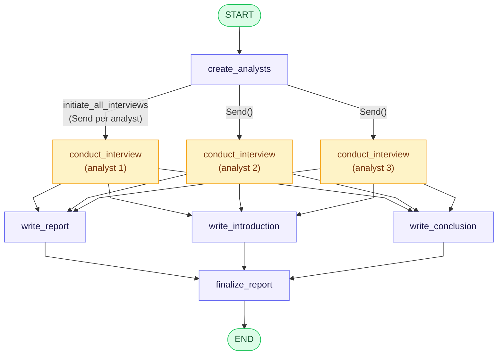
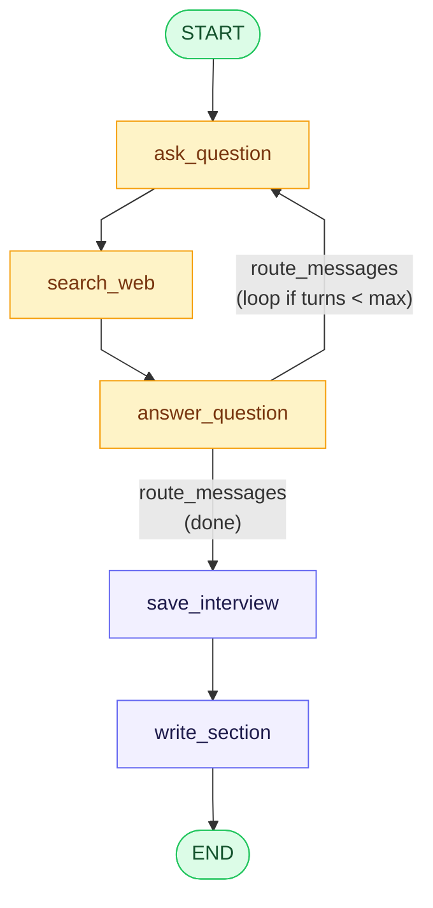
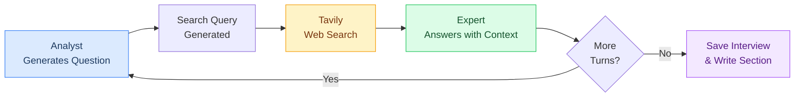
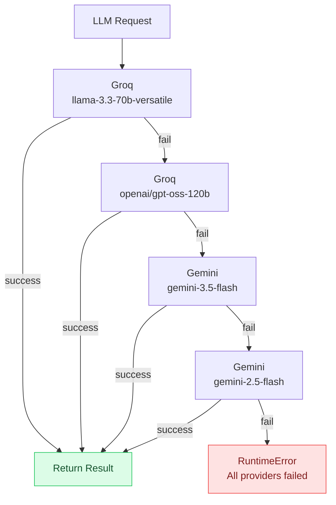
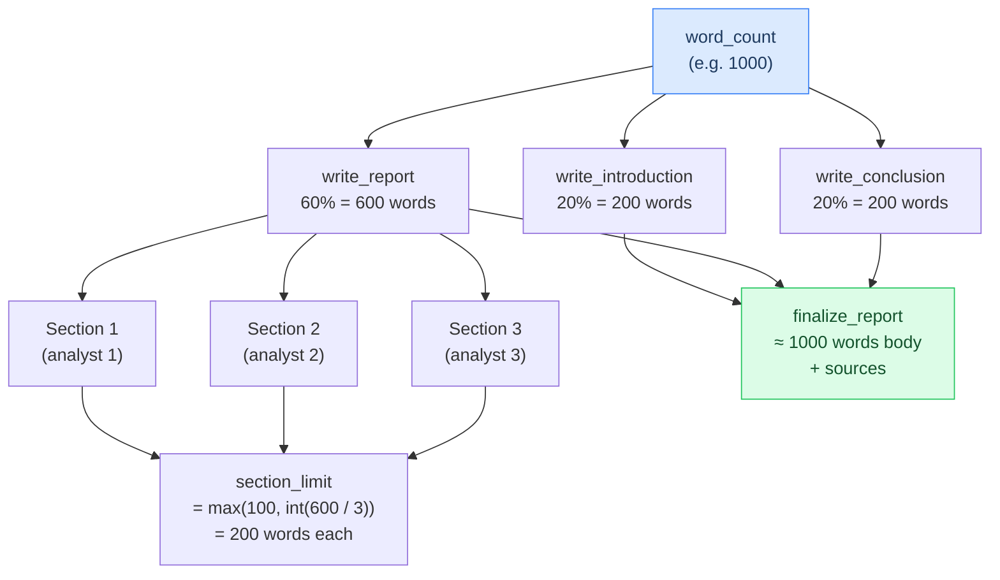
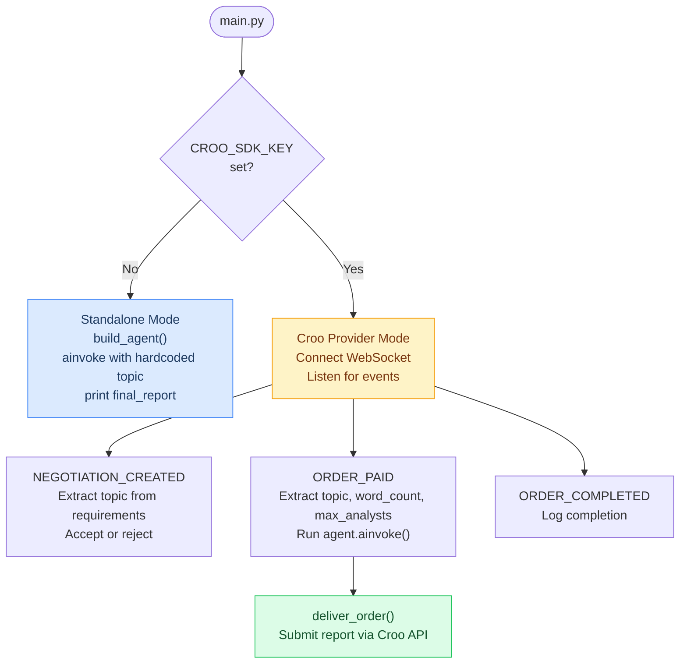
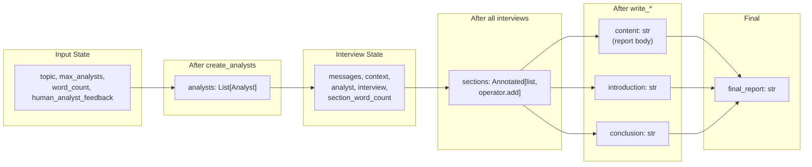

# PYRMYD2

> An AI-powered deep research agent that generates multi-perspective reports through simulated expert interviews and real-time web search.

[](https://www.python.org/downloads/)
[](https://github.com/langchain-ai/langgraph)
[](LICENSE)

---

## Overview

PYRMYD2 is a hierarchical multi-agent research system built with **LangGraph**. Given a research topic and a target word count, it autonomously:

1. **Generates analyst personas** — each with a unique role, affiliation, and research focus
2. **Conducts parallel interviews** — each analyst engages in multi-turn Q&A with an AI expert, backed by real-time **Tavily web search**
3. **Writes section memos** — each analyst summarizes their interview into a structured markdown section
4. **Assembles the final report** — a report writer consolidates all sections, then a separate introduction and conclusion are generated

The system supports multiple LLM providers with automatic fallback, and can operate standalone or as a **Croo platform provider** fulfilling research orders via WebSocket.

---

## Architecture

### Main Agent Graph

The top-level agent is a LangGraph `StateGraph(ResearchGraphState)` compiled with a `MemorySaver` checkpointer.



**Key behaviors:**
- Analysts are created first, then interviews run **in parallel** via LangGraph's `Send()` API
- `write_report`, `write_introduction`, and `write_conclusion` run in parallel after all interviews complete
- `finalize_report` assembles everything: intro + body + conclusion + sources

---

## How It Works

### Interview Sub-graph

Each analyst's interview is a self-contained sub-graph (`interviewBuilder()`) that runs the multi-turn Q&A cycle:



**Interview loop:**
1. The analyst generates a question based on their persona and prior conversation
2. A search query is generated and executed via Tavily (with retry and backoff)
3. The expert answers using the retrieved web context
4. The loop continues until `max_num_turns` is reached or the analyst signals completion
5. The full interview is serialized and written into a markdown section memo

### Multi-turn Interview Cycle



---

## LLM Providers

The system supports multiple LLM providers with automatic fallback. When a provider fails, the next one in the chain is tried.

| Provider | Models | LangChain Wrapper | Use Case |
|----------|--------|-------------------|----------|
| **Gemini** | `gemini-3.5-flash`, `gemini-2.5-flash` | `ChatGoogleGenerativeAI` | General (default) |
| **Groq** | `llama-3.3-70b-versatile`, `openai/gpt-oss-120b` | `ChatGroq` | Fast inference, search queries |
| **OpenCode** | `deepseek-v4-pro`, `kimi-k2.7-code`, `glm-5.2` | `ChatOpenAI` | OpenAI-compatible models |
| **OpenCode** | `qwen3.7-plus`, `qwen3.7-max`, `minimax-m3` | `ChatAnthropic` | Anthropic-compatible models |
| **Qwen** | `qwen3.7-plus` | `ChatOpenAI` | Alibaba DashScope |

### Provider Fallback Chain



The `_invoke_structured_with_fallback()` function iterates through providers and models, catching exceptions at each level. Some nodes override the default chain:

| Node | Provider Override |
|------|-------------------|
| `search_web` (query generation) | Groq only |
| `write_section` | Groq only |
| All other nodes | Full fallback chain |

---

## Word Count Budget

The `word_count` parameter controls the total report length. It is distributed across three writing stages:



**Formula:**
```
section_limit = max(100, int(word_count * 0.6 / max_analysts))
intro_limit   = max(50, int(word_count * 0.2))
concl_limit   = max(50, int(word_count * 0.2))
```

---

## Quick Start

### Prerequisites

- Python 3.12+
- [uv](https://docs.astral.sh/uv/) (recommended) or pip

### Installation

```bash
# Clone the repository
git clone https://github.com/your-org/pyrmyd2.git
cd pyrmyd2

# Install with uv (recommended)
uv sync

# Or with pip
pip install -r requirements.txt
```

### Environment Setup

Copy the example env file and fill in your API keys:

```bash
cp .env.examples .env
```

Required keys (at minimum one LLM provider):

| Variable | Purpose |
|----------|---------|
| `GOOGLE_API_KEY` | Google Gemini API key |
| `GROQ_API_KEY` | Groq API key |
| `OPENCODE_API_KEY` | OpenCode API key |
| `DASHSCOPE_API_KEY` | Alibaba DashScope API key |
| `TAVILY_API_KEY` | Tavily web search API key |

---

## Standalone vs Croo Mode

The agent operates in two modes depending on whether a Croo SDK key is configured:



### Standalone Mode

```python
import asyncio
from research_agent import build_agent

agent = build_agent()

async def run():
    result = await agent.ainvoke({
        "topic": "How decentralized AI inference networks are challenging centralized providers",
        "max_analysts": 3,
        "word_count": 1000,
    })
    print(result["final_report"])

asyncio.run(run())
```

### Croo Provider Mode

```python
import asyncio
from research_agent import build_agent
from provider_handler import ResearchProviderHandler
from croo import AgentClient, Config as CrooConfig
from config import Config

cfg = Config()
agent = build_agent()

async def run():
    croo_cfg = CrooConfig(api_url=cfg.croo_api_url, ws_url=cfg.croo_ws_url, sdk_key=cfg.croo_sdk_key)
    client = AgentClient(croo_cfg)
    handler = ResearchProviderHandler(client, agent)
    await handler.start()
    await asyncio.Event().wait()  # Run forever

asyncio.run(run())
```

---

## Data Flow

State flows through the agent graph via typed dictionaries. Here's how data moves between nodes:



### State Types

| State Type | Used By | Key Fields |
|------------|---------|------------|
| `GenerateAnalystsState` | `create_analysts` | `topic`, `max_analysts`, `human_analyst_feedback`, `analysts` |
| `InterviewState` | Interview sub-graph | `messages`, `context` (reducer: append), `analyst`, `interview`, `section_word_count` |
| `ResearchGraphState` | Main graph | `topic`, `sections` (reducer: append), `introduction`, `content`, `conclusion`, `final_report`, `word_count` |

---

## Project Structure

```
pyrmyd2/
├── config.py                # Config dataclass, env var loading
├── main.py                  # Entry point: standalone or Croo provider mode
├── research_agent.py        # Core agent: graph, nodes, edges, LLM providers
├── provider_handler.py      # Croo WebSocket event handler
├── agent_res.py             # Legacy agent variant (with human-in-the-loop)
├── notebook/
│   ├── research_agent.ipynb  # Main development notebook with full agent tests
│   ├── agent_res.ipynb       # Legacy agent notebook with human feedback demos
│   ├── opencode_test.ipynb   # LLM provider connection tests
│   └── wikipedia.ipynb       # Wikipedia API exploration
├── pyproject.toml           # Project metadata and dependencies
├── requirements.txt         # Pip-compatible dependencies
├── .env.examples            # Example environment variables
├── .python-version          # Python 3.12
└── README.md                # This file
```

---

## Notebooks

| Notebook | Purpose |
|----------|---------|
| `research_agent.ipynb` | Primary development notebook. Contains Mermaid diagram rendering, full end-to-end agent invocations with various `max_analysts` and `word_count` settings, and streaming output inspection. |
| `agent_res.ipynb` | Legacy notebook demonstrating the **human-in-the-loop** workflow with the older `agent_res.py` agent. Shows interrupt-before pattern, state inspection, and feedback injection. |
| `opencode_test.ipynb` | Tests all LLM provider connections (Gemini, Groq, OpenCode, Qwen) with simple prompts to verify API keys and endpoints. |
| `wikipedia.ipynb` | Exploratory notebook for the `wikipediaapi` library. Develops a `wikipedia_search_to_docs()` function with relevance filtering via fuzzy matching. |

---

## Dependencies

| Package | Version | Purpose |
|---------|---------|---------|
| `langgraph` | `>=1.2.8` | Agent orchestration and graph execution |
| `langchain` | `>=1.3.11` | Core LLM abstraction layer |
| `langchain-google-genai` | `>=4.2.7` | Google Gemini integration |
| `langchain-groq` | `>=1.1.3` | Groq integration |
| `langchain-openai` | `>=1.3.3` | OpenAI-compatible API (OpenCode, Qwen) |
| `langchain-anthropic` | `>=1.4.8` | Anthropic-compatible API (OpenCode) |
| `langchain-tavily` | `>=0.2.18` | Tavily web search |
| `langchain-community` | `>=0.4.2` | Community integrations |
| `pydantic` | `>=2.13.4` | Schema validation and data models |
| `python-dotenv` | `>=1.2.2` | Environment variable loading |
| `croo-sdk` | `>=0.2.1` | Croo platform WebSocket and API client |
| `httpx` | `>=0.28.1` | Async HTTP client |
| `wikipedia-api` | `>=0.15.0` | Wikipedia API client |
| `ipykernel` | `>=7.3.0` | Jupyter notebook kernel |

---

## Environment Variables

| Variable | Required | Default | Description |
|----------|----------|---------|-------------|
| `GOOGLE_API_KEY` | For Gemini | — | Google Gemini API key |
| `GROQ_API_KEY` | For Groq | — | Groq API key |
| `OPENCODE_API_KEY` | For OpenCode | — | OpenCode API key |
| `DASHSCOPE_API_KEY` | For Qwen | — | Alibaba DashScope API key |
| `TAVILY_API_KEY` | Yes | — | Tavily web search API key |
| `CROO_SDK_KEY` | For Croo mode | `""` | Croo platform SDK key |
| `CROO_API_URL` | No | `https://api.croo.network` | Croo API base URL |
| `CROO_WS_URL` | No | `wss://api.croo.network/ws` | Croo WebSocket URL |

---

## API Reference

### Core Functions (`research_agent.py`)

| Function | Signature | Returns | Description |
|----------|-----------|---------|-------------|
| `_llm` | `(provider: str, model: str \| None)` | Chat model instance | Factory that returns the appropriate LangChain chat model |
| `_invoke_structured_with_fallback` | `(messages, schema, providers, log_label)` | Schema instance or AIMessage | Tries multiple (provider, model) pairs with structured output support |
| `_invoke_tavily_with_retry` | `(query, max_results, max_retries, backoff_seconds, log_label)` | List of search results | Tavily search with retry and linear backoff |
| `create_analysts` | `(state: GenerateAnalystsState)` | `{"analysts": List[Analyst]}` | Generates analyst personas via structured output |
| `generate_question` | `(state: InterviewState)` | `{"messages": [AIMessage]}` | Analyst generates a question based on persona |
| `search_web` | `(state: InterviewState)` | `{"context": [str]}` | Generates query, runs Tavily, formats results |
| `generate_answer` | `(state: InterviewState)` | `{"messages": [AIMessage]}` | Expert answers using web context |
| `save_interview` | `(state: InterviewState)` | `{"interview": str}` | Serializes message history to string |
| `write_section` | `(state: InterviewState)` | `{"sections": [str]}` | Writes markdown section from interview context |
| `write_report` | `(state: ResearchGraphState)` | `{"content": str}` | Consolidates sections into report body |
| `write_introduction` | `(state: ResearchGraphState)` | `{"introduction": str}` | Writes report introduction |
| `write_conclusion` | `(state: ResearchGraphState)` | `{"conclusion": str}` | Writes report conclusion |
| `finalize_report` | `(state: ResearchGraphState)` | `{"final_report": str}` | Assembles intro + body + conclusion + sources |
| `build_agent` | `()` | Compiled graph | Builds and compiles the main research agent graph |
| `interviewBuilder` | `()` | Compiled graph | Builds and compiles the interview sub-graph |

### Config (`config.py`)

| Method | Description |
|--------|-------------|
| `Config()` | Creates config from environment variables |
| `Config.from_env()` | Class method (same as `Config()`) |

### Provider Handler (`provider_handler.py`)

| Method | Description |
|--------|-------------|
| `ResearchProviderHandler(client, agent)` | Initializes with Croo client and agent graph |
| `.start()` | Connects WebSocket, registers event handlers |
| `.stop()` | Closes WebSocket stream |

---

## License

MIT
